  

  
  

  
  

---

## 👨‍💻 About me

I'm an Engineering Lead with **7+ years** architecting and scaling production systems across **FinTech, RegTech &amp; EdTech**. I build high-traffic full-stack applications, lead cross-functional engineering teams, and mentor developers into industry-ready careers.

I thrive at the intersection of **technical excellence** and **impactful delivery**.

- 🏗️ &nbsp; Building production-grade systems end to end, from system design through deployment
- 🎓 &nbsp; Senior Software Instructor &amp; SME, with **1,000+ devs mentored** into industry-ready careers
- 🚢 &nbsp; **30+ end-to-end features shipped**, concept to production
- 🏆 &nbsp; **"Owning the Problem"** award · Vested Finance · 2023
- 🌍 &nbsp; Operating remote-first across global timezones

---

## 🛠️ Tech Stack

  

<b>Languages</b>

 

  
  
  
  
  

<b>Frontend</b>

 

  
  
  
  
  
  
  
  

<b>Backend</b>

 

  
  
  
  
  
  
  

<b>Databases</b>

 

  
  
  
  
  

<b>Cloud/DevOps</b>

 

  
  
  
  
  
  

<b>Tools</b>

 

  
  
  
  
  
  
  
  

---

## 💼 Experience

| Role | Company | Duration |
|------|---------|----------|
| **Staff Software Engineer** | TechPassport, London *(Remote)* | 3 years |
| **Engineering Lead** | Vested Finance, Berkeley *(Remote)* | 2 years |

**Key highlights**

**TechPassport** *(Staff Software Engineer)*

- 💳 Architected and owned the complete monetization stack from scratch: Stripe payment integration, subscription management, and billing schema
- ⚡ Cut API response times by **75 to 80%** through caching strategies, query optimization, and async refactoring across high-traffic endpoints
- 📊 Engineered configurable supplier workflows with buyer-driven dynamic forms and complex D3.js relational data visualizations, expanding the product's core analytical capabilities
- 🚢 Independently drove the full design to engineering pipeline using Figma, shipping 10+ features end to end from concept to production

**Vested Finance** *(Engineering Lead)*

- 👥 Led engineering squads within 15+ member cross-functional teams spanning product, business, marketing, and SEO; owned sprint planning and delivery of 10+ major features on a high-traffic FinTech platform
- 🏗️ Authored scalable system design documents that became the team's reference for new feature architecture
- ⚡ Drove measurable query performance gains through optimization, caching, and structured logging
- 🎓 Aligned engineering strategy with business goals; upskilled the entire engineering team through structured internal training sessions
- 🏆 Recognized with the **"Owning the Problem"** award (Jan 2023) for leading initiatives end to end across ideation, development, testing, and release

📄 [Full experience on LinkedIn →](https://www.linkedin.com/in/ankitkumarmishra/)

---

## 📊 GitHub

  
  

  

  

  

---

## 🤝 Connect

  
  

---

  <i>Engineering at the intersection of <b>technical excellence</b> &amp; <b>impactful delivery</b>.</i>

