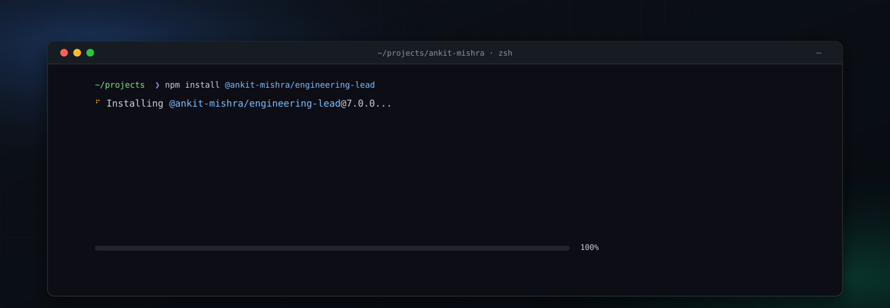

  <a href="https://ankitkumarmishra.is-a.dev">
    <picture>
      <source media="(prefers-color-scheme: dark)" srcset="https://ankitkumarmishra.is-a.dev/brand/hero-dark.svg?v=5">
      <source media="(prefers-color-scheme: light)" srcset="https://ankitkumarmishra.is-a.dev/brand/hero-light.svg?v=5">
      
    </picture>
  </a>

  
  
  

  
  

---

## 👨‍💻 About me

I'm **Ankit Kumar Mishra**, an Engineering Lead and Full-Stack Engineer with **7+ years** building production systems in **FinTech and RegTech**: KYC and compliance, payments, API performance, and LLM applications, with earlier work in EdTech and MediaTech. I lead cross-functional engineering teams and have mentored **1,000+ developers**.

- 🏗️ &nbsp; Staff Software Engineer at **TechPassport**: built the monetization stack from scratch and cut API response times by **75 to 80%**
- 📈 &nbsp; **Promoted twice in 12 months** at Vested Finance, to Engineering Lead of the KYC/Compliance and Premium squads
- 🚢 &nbsp; **50+ end-to-end features shipped**, concept to production
- 🎓 &nbsp; Subject Matter Expert and lead instructor: **50+ batches** taught, **1,000+ developers** mentored
- 🏆 &nbsp; **"Owning the Problem"** award · Vested Finance · Jan 2023
- 🌍 &nbsp; Remote-first with teams in the US, UK and EU

---

## 🔗 Portfolio

<a href="https://ankitkumarmishra.is-a.dev/">
  <picture>
    <source media="(prefers-color-scheme: dark)" srcset="https://ankitkumarmishra.is-a.dev/brand/portfolio-card-dark.svg?v=3">
    <source media="(prefers-color-scheme: light)" srcset="https://ankitkumarmishra.is-a.dev/brand/portfolio-card-light.svg?v=3">
    
  </picture>
</a>

The full story in one page:
[Read the resume](https://ankitkumarmishra.is-a.dev/resume) ·
[Download the PDF](https://ankitkumarmishra.is-a.dev/AnkitKumarMishraResume.pdf) ·
[See the projects](https://ankitkumarmishra.is-a.dev/#projects) ·
[Ask the page](https://ankitkumarmishra.is-a.dev/#ask)

---

## 🚀 Featured projects

| Project | What it is | Built with |
|---------|------------|------------|
| **[Crypto Trading App](https://github.com/AnkitKumarMishra5/crypto-trading-app)** · [live](https://crypto-trading-app-akm.vercel.app) | Solana trading terminal that executes real swaps on mainnet, signed in the browser with an embedded wallet | Next.js, TypeScript, Solana, Jupiter, Privy |
| **[Outlay](https://github.com/AnkitKumarMishra5/outlay-expense-tracker)** · [live](https://outlay-expense-tracker.vercel.app) | Expense tracker and validator for Indian credit card statements: up to 13 checks against the bank's printed totals, AES-256-GCM encryption per account | Next.js, TypeScript, Postgres |
| **[Game Night](https://github.com/AnkitKumarMishra5/gamenightapp)** · [live](https://gamenightapp.onrender.com) | Real-time multiplayer party games on an authoritative Socket.IO server, covered by 568 end-to-end checks | Node.js, Socket.IO, PWA, OpenAI |
| **[Investor Copilot](https://github.com/AnkitKumarMishra5/investor-copilot)** · [live](https://investor-copilot.vercel.app) | Private-markets assistant: OpenAI tool calling handles intent, a deterministic compute layer does every calculation | Next.js, TypeScript, OpenAI |

More on [my GitHub](https://github.com/AnkitKumarMishra5?tab=repositories).

---

## 🛠️ Tech Stack

  

<b>Languages</b>

 

  
  
  
  
  
  

<b>Frontend</b>

 

  
  
  
  
  
  
  
  
  
  

<b>Backend</b>

 

  
  
  
  
  
  
  
  

<b>AI and LLM</b>

 

  
  
  
  
  
  
  
  

<b>Databases</b>

 

  
  
  
  
  
  

<b>Cloud/DevOps</b>

 

  
  
  
  
  
  

<b>Tools</b>

 

  
  
  
  
  
  
  
  

---

## 💼 Experience

| Role | Company | Dates |
|------|---------|-------|
| **Staff Software Engineer** | TechPassport, London *(Remote)* | May 2023 – Present |
| **Engineering Lead** | Vested Finance, Berkeley *(Remote)* | June 2022 – May 2023 |
| **Software Engineer, then Senior Software Engineer** | Vested Finance, Berkeley *(Remote)* | June 2021 – June 2022 |
| **Software Engineer** | GiveIndia, Bengaluru *(Remote)* | Jan 2021 – June 2021 |
| **Software Engineer Intern** | Pratilipi, Bengaluru *(Remote)* | Aug 2020 – Jan 2021 |

**TechPassport** *(Staff Software Engineer)*

- 💳 Architected and own the complete monetization stack, built from scratch: Stripe payment integration, subscription management, and the full billing schema
- ⚡ Cut API response times by **75 to 80%** through caching strategies, query optimization, and async refactoring across high-traffic endpoints
- 📊 Engineered configurable supplier workflows with buyer-driven dynamic forms and complex D3.js relational data visualizations
- 🚢 Drive the full design-to-engineering pipeline in Figma, shipping 10+ features end to end from concept to production

**Vested Finance** *(Engineering Lead)*

- 👥 Led the KYC/Compliance and Premium Management squads as engineering lead and de facto product owner, scoping roadmaps without PMs and running delivery end to end
- 🌍 Extended onboarding from a single market to global users by integrating alternate KYC providers and building region-aware compliance and verification flows
- 💰 Unified subscription billing across Stripe, Razorpay, and Google Play and Apple in-app purchases
- 🏗️ Set technical direction for a 5+ engineer squad inside a 15+ member cross-functional team: system design documents, query optimization, structured logging, and internal training
- 🏆 Recognized with the **"Owning the Problem"** award (Jan 2023)

💼 [LinkedIn →](https://www.linkedin.com/in/ankitkumarmishra/) · 📄 [Full resume →](https://ankitkumarmishra.is-a.dev/resume)

---

## 📊 GitHub

  <picture>
    <source media="(prefers-color-scheme: dark)" srcset="https://streak-stats.demolab.com/?user=ankitkumarmishra5&theme=github-dark-blue&hide_border=true&background=00000000">
    <source media="(prefers-color-scheme: light)" srcset="https://streak-stats.demolab.com/?user=ankitkumarmishra5&theme=default&hide_border=true&background=00000000">
    
  </picture>

---

## 🤝 Connect

  
  
  

